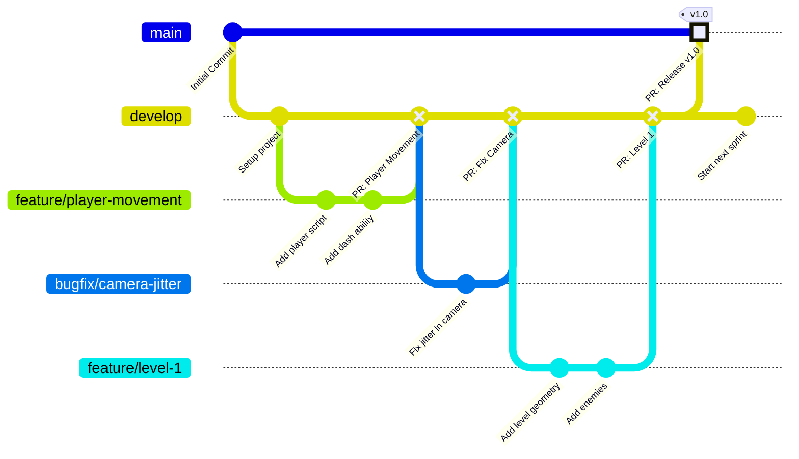

# Git Workflow Visual Guide

This document visualizes the Git workflow used in the Godot-Crane-Nerves project. It illustrates how feature branches, bugfixes, and releases move through the `develop` and `main` branches.

## The Development Flow



## Step-by-Step Process

1. **Start from `develop`**:
   All new work starts by branching off the `develop` branch.
   ```bash
   git checkout develop
   git pull origin develop
   ```

2. **Create a Feature/Bugfix Branch**:
   Create a new branch for your specific task using the proper naming convention.
   ```bash
   git checkout -b feature/your-feature-name
   ```

3. **Develop and Commit**:
   Make your changes, test them locally, and commit with clear messages.
   ```bash
   git add .
   git commit -m "Add new feature functionality"
   ```

4. **Push and Open a Pull Request**:
   Push your branch to GitHub and open a Pull Request targeting the `develop` branch.
   ```bash
   git push origin feature/your-feature-name
   ```

5. **Review and Merge**:
   After the PR passes automated checks and is approved by a reviewer, it is merged into `develop`. Your feature branch can then be deleted.

6. **Release to `main`**:
   When `develop` reaches a stable milestone, a Pull Request is opened to merge `develop` into `main`. This triggers a release and represents the new production state.
