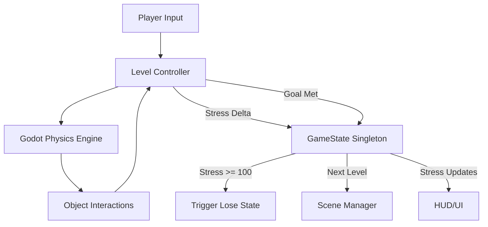

# Architecture

This document describes the high-level system design, data flow, and interactions between systems in the Godot-Crane-Nerves project.

## Overview

Godot-Crane-Nerves is a 3D Godot 4.x game ported from a React prototype. It is a physics-based comedy game where the player performs cranial nerve exams. The primary mechanic revolves around managing "stress" and correctly executing complex controls under difficult physics conditions.

The architecture emphasizes:
- **Global State Management:** To keep track of the current level, overall game state, and player stress.
- **Level Modules:** Each level is encapsulated in its own scene and logic, allowing levels to be developed and tested independently.
- **Physics-Driven Gameplay:** Most mechanics rely on Godot's physics engine (`CharacterBody3D`, `RigidBody3D`, `Area3D`) for the intense and comedic interactions.
- **UI Overlay:** A generic HUD (Heads-Up Display) overlaying the 3D game world.

## High-Level Components

### 1. Game State (`GameEngine`)
The equivalent of the prototype's `GameEngine.tsx` is typically managed via an Autoload (Singleton) in Godot, e.g., `GameState.gd`. This tracks:
- Current level ID.
- Global stress level (0-100).
- Level transition logic (win/lose conditions).
- Pause/Quit state.

### 2. Main Scene Structure
The main scene acts as the container. It instances:
- The **3D Environment** (`DoctorsOffice3D`), providing the visual backdrop.
- The **Current Level Scene**, instantiated dynamically based on the current `LevelId`.
- The **HUD/UI Layer**, drawn over the 3D scene.

### 3. Level Architecture
Each level (e.g., `Level1_Olfactory.tscn`) is its own sub-scene. They share a common structure but contain unique mechanics:
- **Level Controller Script:** Manages the win condition logic and sends stress updates to the `GameState`.
- **Physics Objects:** Interactable objects that the player controls or reacts to.
- **Specific UI:** Elements unique to the level (like instructions or mini-games).

### 4. Patient Stress System
Stress is the core fail state. It's updated 60 times per second (via `_process` or `_physics_process` in Godot).
- **Triggers:** Physics collisions, failing to perform an action in time, making incorrect choices.
- **Threshold:** When stress reaches 100, the `GameState` triggers the lose condition and passes the relevant failure reason.

### 5. Camera System
The camera requires special handling to replicate the prototype's mouse-tracking "sway" or specific fixed perspectives. A central `Camera3D` is typically updated by player inputs.

## Data Flow Diagram

## Migration Considerations (React to Godot)

1. **Re-renders vs. Game Loop:** In React, state changes triggered re-renders, causing optimization issues (e.g., the Bolt Optimization notes). In Godot, state changes are handled in `_process(delta)` or `_physics_process(delta)`, updating properties directly without "re-rendering" the scene tree.
2. **Component to Node:** React components translate to Godot Scenes (`.tscn`) and Nodes.
3. **State Management:** Props drilling is replaced by Signals and Autoloads. The `GameState` Singleton will emit a `stress_changed` signal, which the HUD listens to.
